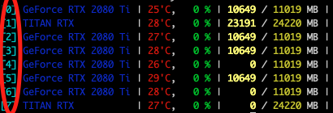
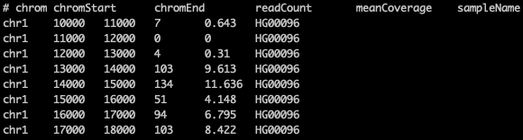
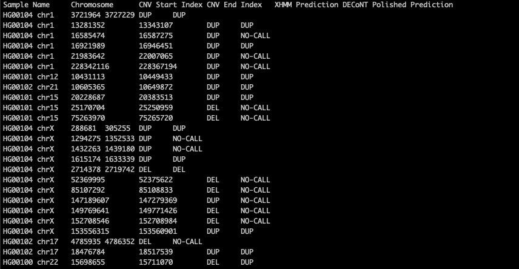

# Polishing Copy Number Variant Calls on Exome Sequencing Data via Deep Learning

<p align="center">
<a href="https://ciceklab.cs.bilkent.edu.tr/DECoNT/"></a><br>

> DECoNT is a deep learning based software that corrects CNV predictions on exome sequencing data using read depth sequences.

> <a href="https://en.wikipedia.org/wiki/Deep_learning" target="_blank">**Deep Learning**</a>, <a href="https://en.wikipedia.org/wiki/Copy-number_variation" target="_blank">**Copy Number Variation**</a>, <a href="https://en.wikipedia.org/wiki/Exome_sequencing" target="_blank">**Whole Exome Sequencing**</a>


---

## Authors

Furkan Ozden, Can Alkan, A. Ercument Cicek

---

## Questions & comments 

[firstauthorname].[firstauthorsurname]@bilkent.edu.tr

---


## Table of Contents 

> Warning: Please note that DECoNT software is completely free for academic usage. However it is licenced for commercial usage. Please first refer to the [License](#license) section for more info.

- [Installation](#installation)
- [Features](#features)
- [Instructions Manual](#instructions-manual)
- [Usage Examples](#usage-examples)
- [FAQ](#faq)
- [Citations](#citations)
- [License](#license)


---

## Installation

- DECoNT does not require installation in conventional manner. DECoNT is a python3 script ready to run with required packages installed. 

### Requirements

- Python 3.7.6
- NumPy 1.16.2
- Pandas 1.0.0
- TensorFlow 1.14.0
- Keras-gpu 2.2.4
- Scikit-Learn 0.22.1
- keras-metrics 1.1.0
- cudnn 7.6.5 (optional, for gpu support only)

For easy requirement handling, you can use DECoNT_env.yml file to initialize appropriate environment with conda using:
```shell
$ conda env create -f DECoNT_env.yml
$ conda activate DECoNT_env
```
---

## Features

- DECoNT provides GPU support optionally. See [GPU Support](#gpu-support) section.
- DECoNT provides ETA for the analysis with progress bar.
- Upcoming version: custom training, custom call polishing.

## Instructions Manual

### Required Arguments

#### -m, --model
- For version 0.1, DECoNT provides pretrained weights for polishing CNV calls from the following WES-based CNV callers: (i) XHMM; (ii) CoNIFER; (iii) CODEX2; (iv) Control-FREEC.
- If you want to use pretrained DECoNT weights for polishing set this argument to <b>pretrained</b>.
- If you want to use custom model weights for DECoNT obtained using DECoNT_train.py script, please provide path to model weights with <b>.h5</b> extension instead. 

#### -cn, --callername
- For version 0.1, DECoNT supports only XHMM, CoNIFER, CODEX2 and Control-FREEC. For future versions, DECoNT will be able to polish any CNV output format with a required CNV output template.
- Set to one of the WES-based CNV caller names above for DECoNT to understand the required weights for the polishing process. 

#### -i, --input
- Relative or direct path to output file of selected WES based CNV caller. 

#### -o, --output
- Relative or direct output directory path to write DECoNT output file.

#### -s, --samples

- Relative or direct directory path to read depth files of samples in the analysis (i.e. samples used in WES CNV calling). Note that, all read depth files must be in the format specified below in the examples section. The provided directory must not include any other files. Read depth files generated by Sambamba tool are directly accepted with no formatting requirements.
- Read depth file names must have the following format: SAMPLENAME.read_depths.txt (e.g. HG00096.read_depths.txt)
- The sample names should be consistent between obtained WES-CNV outputs and read depth file names.

### Optional Arguments

#### -g, --gpu
- Set to PCI BUS ID of the gpu in your system.
- You can check, PCI BUS IDs of the gpus in your system with various ways. Using gpustat tool check IDs of the gpus in your system like below:

```shell
$ gpustat
``` 


#### -v, --version
-Check the version of DECoNT.

#### -h, --help
-See help page.


## Usage Examples

> Usage of DECoNT is very simple, also it comes with ETA and progress bar features!

<p align="center">


### Step-1: Use your preferred WES-based CNV caller to call CNVs on your WES dataset.

- For XHMM refer to: <a href="https://atgu.mgh.harvard.edu/xhmm/tutorial.shtml" target="_blank">**XHMM Manual Page**</a>
- For CoNIFER refer to: <a href="http://conifer.sourceforge.net/tutorial.html" target="_blank">**CoNIFER Manual Page**</a>
- For CODEX2 refer to: <a href="http://conifer.sourceforge.net/tutorial.html" target="_blank">**CODEX2 Manual Page**</a>
- For Control-FREEC refer to: <a href="http://boevalab.inf.ethz.ch/FREEC/tutorial.html">**Control-FREEC Manual Page**</a>
- After obtaining output file from one of these tools, store it.
- For purposes of this tutorial, lets call the output WES CNV file:  /home/user/analysis.txt

### Step-2: Obtain read depth files for samples used in WES CNV calling.

- Read depth counts obtained using <a href="https://lomereiter.github.io/sambamba/" target="_blank">**Sambamba**</a> tool are directly accepted by DECoNT. Note that you should use -w option of sambamba with parameter 1000. By doing so, sambamba sets base-pair resolution to 1000bp. You can run sambamba on your inputs as follows:

```shell
$ sambamba depth window -w 1000 HG00096.wes.bam > /home/user/sambamba_read_depths/HG00096.wes.bam_read_depths.txt
``` 
- Note that, all read depth files must have SAMPLENAME. prefix in the file name.
- You can use any read depth generator you like, however for DECoNT to have unified input format, we require the following format for read depth files:



-Note that, DECoNT does not use mean coverage information column provided in the above file format figure. You can fill that column with all 0's.
- For purposes of this tutorial, lets call the directory containing all described read depth files: /home/user/sambamba_read_depths/

### Step-3: Run DECoNT on data obtained in Step-1 and Step-2

- Requirements of DECoNT must be satisfied. For easy handling of requirements download DECoNT_env.yml file and initialize environment of DECoNT as follows (optional).

```shell
$ conda env create -f DECoNT_env.yml
$ conda activate DECoNT_env
```

- Note: for the scope of this tutorial, we assume that WES CNV calls are obtained using XHMM software. If you obtain WES CNV calls using any other software just change the -cn argument to that software.
- After initializing the envorinment, run decont as follows:

```shell
$ python ./DECoNT_polish.py -m pretrained -cn XHMM -i /home/user/analysis.txt -o /home/user/ -s /home/user/sambamba_read_depths/
```
- Optionally, if you have available gpu's, you can set -g argument to PCI BUS ID of the GPU you want to use. Please refer to Optional Arguments section. By default, script will use CPU.

```shell
$ python ./DECoNT_polish.py -g 5 -m pretrained -cn XHMM -i /home/user/analysis.txt -o /home/user/ -s /home/user/sambamba_read_depths/ 
```

### Output file of DECoNT
- At the end of the polishing procedure, DECoNT will write its output file to the directory given with -o option. In this tutorial it is /home/user/
- Output file of DECoNT is a tab-delimited .bed like format. 
- Columns in the output file of DECoNT are the following with order: 1. Sample Name, 2. Chromosome, 3. CNV Start Index, 4. CNV End Index, 5. XHMM Prediction (XHMM name changes according to the -cn argument), 6. DECoNT Polished Prediction
- Following figure is an example of DECoNT output file.




---

## FAQ

- **How do I do *specifically* so and so?**
    - No problem! Just do this.

---

## Citations

If you use DECoNT in your research, please cite it.

- Bibtex citation
- citation
- citation

---

## License

[](http://badges.mit-license.org)

- **[MIT license](http://opensource.org/licenses/mit-license.php)**
- Copyright 2020 © DECoNT.
